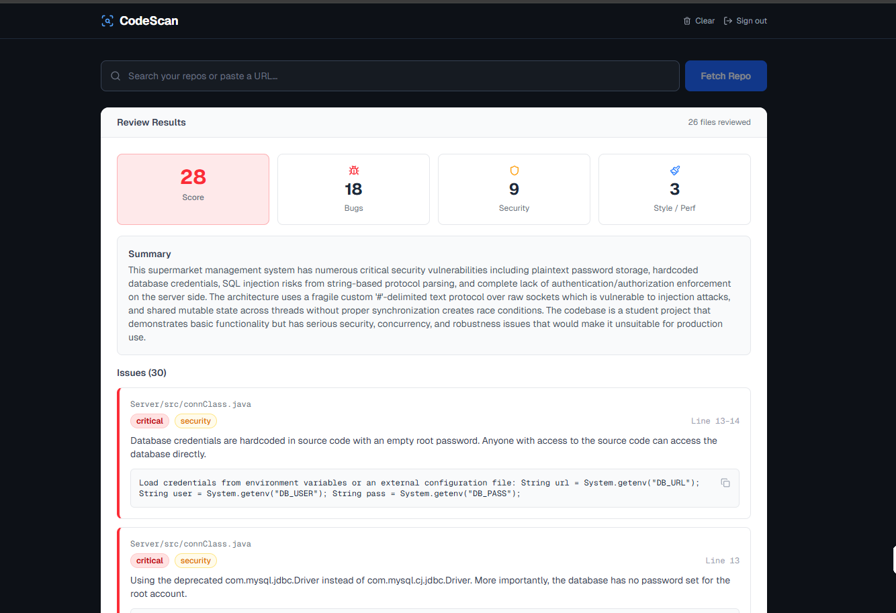

# CodeScan - AI Repository Reviewer

An AI-powered GitHub repository review tool built with Next.js and Claude. Enter any public GitHub repository URL and get a comprehensive code review covering bugs, security vulnerabilities, performance issues, and style problems across your entire codebase.



## Features

- **Full Repository Scanning** - Fetches and reviews up to 50 code files (200 KB total) from any public GitHub repo
- **File Selection** - Toggle select mode to choose specific files before scanning
- **AI-Powered Analysis** - Uses your Claude.ai subscription session — no API key or extra billing required
- **Session Validation** - Verifies your Claude.ai session before starting a scan; shows a one-click reconnect button if expired
- **One-Click Session Setup** - Click "Connect Claude.ai" in the UI to open a browser and log in — no terminal needed
- **Download-style Progress Bar** - Visual scan progress that fills realistically as the review runs
- **Severity Scoring** - Overall quality score (0–100) with per-issue severity and type badges
- **GitHub OAuth** - Sign in with GitHub to access private repositories and browse your repos from a dropdown
- **Persistent Results** - Last review saved to localStorage and restored on page load

## Tech Stack

- Next.js 16 (App Router)
- TypeScript
- Tailwind CSS v4
- Claude.ai web session (no API key required)
- Playwright (automated session login via real Chrome)
- NextAuth.js v5 (GitHub OAuth)
- Lucide React (icons)

## Setup

### 1. Install dependencies

```bash
cd codescan
npm install
```

### 2. Log in with your Claude.ai session

Run the setup script — it opens your real Chrome browser, you log in to claude.ai, and the session cookie is saved to `.env.local` automatically:

```bash
npm run setup:session
```

Or skip the terminal entirely — start the dev server and click the **Connect Claude.ai** button that appears when the session is missing or expired.

> Re-run `npm run setup:session` (or click the button in the UI) any time scans start failing with an auth error.

### 3. Set up GitHub OAuth (optional — required for private repos)

1. Go to [GitHub Developer Settings](https://github.com/settings/developers)
2. Click **New OAuth App**
3. Set the **Authorization callback URL** to `http://localhost:3000/api/auth/callback/github`
4. Copy the **Client ID** and **Client Secret** into `.env.local`
5. Generate `NEXTAUTH_SECRET` with: `openssl rand -base64 32`

Your final `.env.local` should look like:

```env
CLAUDE_SESSION_COOKIE=sessionKey=<auto-filled by setup:session>
GITHUB_CLIENT_ID=your_github_oauth_client_id
GITHUB_CLIENT_SECRET=your_github_oauth_client_secret
NEXTAUTH_SECRET=your_nextauth_secret
NEXTAUTH_URL=http://localhost:3000
```

### 4. Run the dev server

```bash
npm run dev
```

Open [http://localhost:3000](http://localhost:3000) to use CodeScan.

## Usage

1. Enter a GitHub repository URL (e.g. `https://github.com/owner/repo`) or `owner/repo` shorthand
2. Click **Fetch Repo** — CodeScan fetches the repo's file tree and displays it
3. Optionally toggle **Select specific files** to choose which files to include
4. Click **Scan Full Repository** (or **Scan X Selected Files**)
5. The app validates your Claude.ai session first — if expired, a **Connect Claude.ai** button appears
6. Watch the download-style progress bar fill as the review runs
7. View the score card, summary, and detailed issue list with suggested fixes
8. Click **Copy fix** on any issue to copy the AI-suggested code fix

## Scripts

| Command | Description |
|---------|-------------|
| `npm run dev` | Start the development server |
| `npm run build` | Build for production |
| `npm run setup:session` | Open Chrome to log in and auto-save your Claude.ai session cookie |

## API Routes

| Route | Method | Description |
|-------|--------|-------------|
| `/api/repo` | POST | Fetches repo file tree from GitHub |
| `/api/scan` | POST | Fetches file contents and runs Claude review via claude.ai session |
| `/api/check-session` | GET | Validates the current Claude.ai session cookie |
| `/api/setup-session` | POST | Spawns the Playwright login flow from the UI |
| `/api/auth/[...nextauth]` | GET/POST | GitHub OAuth via NextAuth |

## License

MIT
